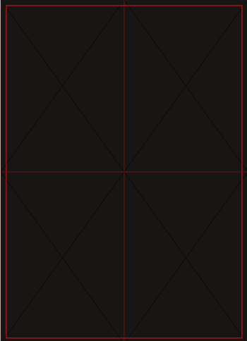
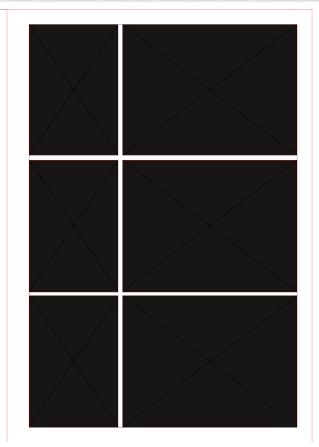

### installation
- create a directory for scribus scripts at a convenient location
- define this directory as cripts directory in scribus preferences
- copy all files (including hidden directories and files) into this scripts directory
- make that all the scripts have execution privilege
- **CAVEAT**: the scripts have only be tested under linux

- launch scribus and within scribus execute the setup.py script which you should see when accessing the Scripts menu and launching a script
- if setup.py does not work (eg Apple Mac), run setup-photobook.py
- select the previously defind scripts directory as well as your preferred units and menu language
- you can redo the setup and overwrite the previous configuration as often as required...the script path will be conserved but can be changed if needed

- you can now use the different scripts

### use for photobook creation
- open the file or create the document you want to work with. **important** the scripts only work if a document is open.
- the scripts use the margins defined in your document
- **important:** the scripts will lock the positions and sizes of the created photoframes, unlock (CTRL-L)to delete or change the size of any photos. You can also convert a photo frame to a text frame by the standard scribus commands.
- the scripts create empty frames, use standard scribus commands to select photos for your frames

#### photobook-page
- creates a page of same size photo frames
- you have to enter the number of photos in width and height as well as the distance between photos
- once the page is created, you can use the other scripts like split-image or combine-images to alter the page to your taste.

#### photobook-1-image
- complement to photobook-page, but only creates 1 image at the coordinates you specify
- you still have to enter the number of photos in width and height as well as the distance between photos
- then enter coordinates relative to the number of photos in each direction eg 1,1 is top left

#### photobook-split-image
- select one photograph and execute the script
- enter the number of photos in width and height as well as the distance between photos
- the photo will be split into a group of photos  according to your choice

#### photobook-combine-images
- select a group of images/photos
- execute the script
- a single photo of the size of the group of images will be created
- all selected photo frames will be deleted (make sure to select all the frames you want to be replaced)
- if the frames already contain photos, the one selected first will be in the final, larger frame

#### swap-frames
- select two frames or photos
- execute the script
- the content of the frames will be swapped

#### photobook-page-with-bleed
- creates a page without margins. Images/photo edges are aligned with the outer border of the bleed, ie the bleed are will be cut during printing to obtain apage without a margin at all. Make sure no important part of your photos is within the bleed.
- pas default, gutter is set to 0, but this can be changed
- run the script, then enter the number of photos in width and height as well as the distance between photos
- example of a page : 

#### photobook-page-asymmetric
- this script creates a page where the photos are not all of the same size, it is a handy way to quickly create a page with a mixture of landscape and portrait photos. Here is an example:
- run the script, then enter the number of picture lines (with one photo for which you specify the image ratio, and another photo filling up the remaining space on the line)
- enter the image ratio for the first photo, eg standard 35 mm ratio=3/2 or 1.5, micro-four thirds: 4/3 or 1.33. You can enter the value as a ratio (eg 3/2), or a real number (eg 1.5). You can enter any ratio as long as the picture width does not increase beyond the page size or the complementary portrait photo does not become to oblong (ratio>2); You can also specify an image ratio<1 to obtain a portrait as the first picture, but this effect can be obtained differently (see below)
- enter the gutter (distance between images)
- enter the direction, ie left2right (default) or right2left: right2left will put the complementary picture first eg see this example!  and compare with the standard above
- enter the page type, ie either all image lines are identical (constant) or the landscape/portait and portrait/landscape page alternate (alternate). See an example for alternate here: 

### use for photodiary creation

- in this context, a photodiary is a photobook containg one or several photos per day, with an accompanying text
- the top of the page states the month
- on the left or right of the photos for each day, the day in the month is indicated
- these scripts are specifically written for 3 days per page, but the acta-1-group allows to adapt the page for showing 2 or three days
- these scripts use a "base" definition of what a generic "day" group should look like. If you change anything (eg color,font) in this "base" file if will change in the resulting photobook from that change point onwards. This is a convenient way to change the look of the resulting photodiary. This file is located in the .photobook hidden directory within the script directory and is called "Annales_base.sla". It is a standard scribus file. You may have to change your operating system preferences to see the hidden directory (under gnome file manger: ctrl-h)

#### Acta-new-page
- creates a page of three photos and text frames, eg three days of diary

#### acta-1-group
- creates a group for a single day, you will have to specify where on the page it is to be created (top (1), middle (2), or bottom (3))
- you can create a standard day group, a day with central text (instead of left or right text), or a bigger group for more photos/day taking up the space for 2 days (double) or three days (whole page)
- play with it and the use of each option will quickly become obvious

