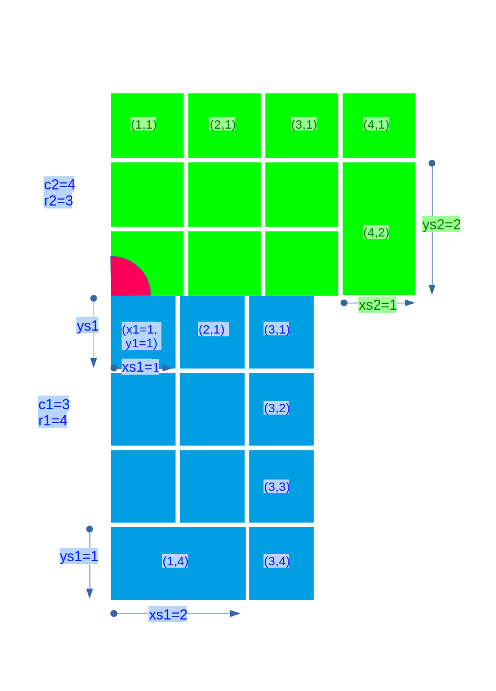

### Introduction
This repository cointains a collection of scribus scripts that facilitate the creation of photobooks in scribus. 

I started this collection of scripts because I became frustrated with the photobook printing services that do not allow saving your creations except on the site itsself. This obviously means that if the site closes down or for whatever reasons decides to remove your photobooks, you will have to start from scratch. After some research on alternatives, I decided to create my photobooks in scribus and export them to pdf for screen viewing (at 150 ppi) or printing (at 300 ppi). Your scribus photobooks are best saved with your images, are very small because they do not contain the pictures themselves but only links to the pictures, and can use all sorts of image formats, including even the new and very convenient JPEG XL files. Pdfs can be generated as needed, with different resolutions and color profiles.

As I live in France, I had some problems finding a photobook print service that accepts pdf files. I finally found [flexilivres](https://www.flexilivre.com/fichier/), which gives me good results (I am not linked to them in any way, and do not endorse them, I just provide this information for your convenience). I found that they apparently convert PDF pages to image files, so you may be able to manually use a similar approach to use other print services with pdf files.

In this version 2, the page build scripts are all available from a graphical main menu, where you can choose your layout depending on the number of landscape, portrait or square photographs that you want to use. All the previous scripts are still available too, and some (like swap-frames, combine-images or split-image are still only available in the previous version, because there is no advantage in integrating them in the main menu (actually, you would need a higher number of clicks if they were implemented in the main menu))

Version 2.1 adds the possibility to have rotated images in the layouts included with the scripts. It is now also possible to split rotated images and combine a mixture of rotated and non-rotated images (version 1 scripts). Please be aware that the final rotation will be the rotation of the first selected frame and that the final size may be larger than expected because scribus evaluates the size taking into accounts the largest distance between corners in the height and width directions. Furthermore, this release also adds another version 1 script: the possibility to visually center an image or group of images within the page margins.

These photobook scripts are very simple and tailored to my specific way of working, therefore I hesitate to accept collaboration on improving the scripts. I will however carefully consider any suggested improvements, as long as I understand and can therefore vouch for the proposed changes. I am not an expert python programmer and I would not feel like reviewing code that I do not fully understand. In a way I feel responsible for the code, and I would therefore be very sorry to let slip through any nefarious changes that might harm those using this code. You are obviously wellcome to fork or clone the repository, although if you are fluent in python programming and the scribus scripter interface you definitely will not need my scripts! 

### A warning to Mac users of Version  2 and later.
Version 2 uses a graphical user interface built using tkinter, which is often not installed correctly on Macs because the  natively installed python version is not complete. Normally, to make sure tkinter works perfectly well on Macs, you have to install python for Mac from the official python.org website [python website](https://www.python.org/). Just go to the "Downloads" tab and select "macOS". Full information on the installation process can be found here: [install on macOS](https://docs.python.org/3/using/mac.html). However, as I do not own a Mac, I only recently learned that scribus seems to use an internal python interpreter with tkinter included and even when the external python works perfectly well, the scribus scripts using tkinter (including the scripts installed by scribus isself) do not work on Macs (as of January 2025). Let's hope that this will change with futher versions of scribus/MacOS.

### Version 2 and 2.1 installation
- download all files from github resulting in a zip file (click on the **<>Code** menu and select **Download Zip**):
  
  

  this will give you the most recent version with all the new layouts that I may have added without creating a new release
  
- Alternatively, you can click on "Version 2, with GUI" or "Version 2.1" below "Releases" on the menu to the right and then download the source code as a zip file
  
#### first installation (version 1 not previously installed)
- create a directory for scribus scripts at a convenient location
- define this directory as scripts directory in scribus preferences
- extract all files (including hidden directories and files) into this scripts directory
- make sure all the scripts have execution privilege (depending on your operating system)
- **CAVEAT**: the scripts have only been tested under Linux

- launch scribus and within scribus execute the setup_photobook_tkinter.py script which you should see when accessing the Scripts menu and launching a script
- in this setup script, the first step is to select the previously defined scripts directory, then select your preferred units and menu language
- you can redo the setup and overwrite the previous configuration as often as required...the script path will be conserved but can be changed if needed

- you can now run the new photobook-build-page script which will show you the main menu or else use the different scripts from version 1

#### installation of version 2 or later if version 1 is already installed
- download the source code zip as explained above
- extract the files into  the scribus scripts directory where the version 1 files are located, overwriting the older files with the new version
- run the setup_photobook_tkinter.py script from within scribus, your path to the scripts directory and previous choices should be conserved, so this should be very quick
- you can now run the new photobook-build-page script which will display the main menu
- please note that on first use, the drawing of the page can be quite slow (really slow!), but on subsequent runs will be much faster (ie immediate on my 12-year-old PC)

### Specific instructions for Ubuntu linux users:
When running the script, Ubuntu (and maybe other Linux systems) will frequently show you a Message box showing "Application not responding" which can be ignored, but is annoying nonetheless. In order to avoid or at least strongly decrease the frequency of this error message, you can increase the check-alive-timeout parameter of mutter to 1 minute (60000 ms):
- install dconf-editor `sudo apt install dconf-editor`
- run dconf-editor from the commandline
- click on org
- click on gnome
- click on mutter
- find check-time-out and deselect "use the default value"
- change the value of  check-time-out to 60000 (=1 min, 60000 ms instead of 5 s)  
- 
### Version 2 use

Version 2 is very simple to use, because once the main menu is launched by running the script photobook-build-page, you just have to click on one of the icons to draw your page:
#### Choose your page layout
- these scribus scripts are intended to work on one page at the time, because this seems the most natural way of working: you define the layout you want for the page using the scripts, and then fill in the image frames with the pictures ou want to use. Start by opening a new document file and customizing the margins to your taste.
- then start the script *photobook-build-page* from the Scripts menu
- the main menu looks like this: 
- you enter the number of landscape, portrait and square photographs you would like to put onto the page, then click on "Show possible layouts"
- the script will then show you any layouts corresponding to this selection of photographs: 
- you then click the icon of the layout to be used, and the page will be drawn immediately and the script will be closed
- if none of the layouts suits your taste, click on the "None are convenient" button and go back to the main menu
- you can then either enter another number of photographs, or click on "All with same total" which will show you all the layouts with the same total number of photographs, be they landscape, portrait or square. This may allow you to find a suitable layout, even if you will have adapt the pictures to some frames by zooming in into the photographs
- if you really do not find any suitable layout, you can click on "Finished" to close all the windows and terminate the script. You will then have to use the version 1 scripts to build your own customized page.
#### Additional parameters
- gutter: enter your preferred distance between the photographs. The default distance works well for me, but may not please you. See below, "More advanced customization" to permanently change the default gutter value
- "Draw into bleed", if checked will draw the layout on the whole page, including the bleed (which is 5 mm and cannot be customized for now, but should be suitable for most of the commercial print services). Make sure nothing important is in the bleed area when you choose your photographs because this area will be cut by the print service after printing the page. If unchecked the layout is drawn within the margins of the page
#### Building a diary page
- please also read the explanation of the diary concept for version 1 below
- click on the "Build diary page" icon to the right to open the diary menu: 
- You can then use a set of ready-made layouts by clicking on the different icons:
  - "Draw standard" page will draw a page for 3 days of diary, using the line types defined on the right of the menu: normal (text to the left or right of 1 photograph depending on the page) is preselected, but you can choose for each line either normal or central (central text above 3 photographs)
  - "Double (top)" will draw a double-sized layout (central text above 6 photographs) at the top of the page, plus a lower line corresponding to the line type selected for line 3 on the right
  - "Double (bottom) will draw a line at the top and the double-sized layout at the bottom
  - "Draw full page" will draw a triple-sized layout with central text and 9 photographs below
  - if you made a mistake, you can manually remove any layout and redo a customized layot by selecting the line type and selectively draw each line by clicking the buttons on the right
  - don't forget that you can also use the version 1 scripts to further customize each layout or select a group of images/frames and replace them by a complex layout by running photobook-build-page on them (but don't forget to decrease the gutter size and also see very important note below)
### Very IMPORTANT note!
The new layouts of version 2 can also be used on any area or group of images selected before running the "photobook-build-page" script. If an area/group of frames is selected before running the script, it will work on this area/group of frames instead of the page. This obviously can be very efficient to draw really complex layouts and was included for this reason!
However, this can also be very problematic if you run the script with a frame or group of frames ou previously worked on still selected, because they will be deleted and replaced by the new layout. So ***BE VERY CAREFUL, and start the "photobook-build-page" script on a new page, unless you select a region/frame you really want to delete and further customize***!
Also, running the script on a group of frames and then trying selecting a layout will combine the frames into a single image even if you abort thereafter. This may surprise you, but *you can go back to the original frames by performing the undo command (Edit menu or better: ctrl-z) several times in sequence.*

### Version 1 use

You start with a page of same-size image frames that you can then adapt to your taste and needs by combinig several frames into a single one (combine images), or split a frame into several smaller ones (split image).

### use for photobook creation
- open the file or create the document you want to work with. **important** the scripts only work if a document is open.
- the scripts use the margins defined in your document
- **important:** the scripts will lock the positions and sizes of the created photoframes, unlock (CTRL-L) to be able to delete or change the size of any photos, relock (CTRL-L) after your modification to avoid accidentally moving the frames. You can also convert a photo frame to a text frame by the standard scribus commands (Object menu, unlock frame first!).
- the scripts create empty frames, use standard scribus commands to select photos for your frames (right click on frame, or CTRL-I to import image). Again use standard scribus commands to adapt the size of the image to the frame, etc. Scribus also has an internal script (align_image_in_frame) to adapt the image to the frame.
- I usually start with a white background, and once the page is completely finalized I swith to a black background because I like the higher contrast the darker background provides.

#### photobook-page
- creates a page of same size photo frames within the margins defined in the scribus file
- you have to enter the number of photos in width and height as well as the distance between photos
- once the page is created, you can use the other scripts like split-image or combine-images to alter the page to your taste.
- example:
  
  

#### photobook-1-image
- complement to photobook-page, but only creates 1 image at the coordinates you specify
- you still have to enter the number of photos in width and height as well as the distance between photos
- then enter coordinates relative to the number of photos in each direction eg 1,1 is top left

#### photobook-split-image
- select one photograph and execute the script
- enter the number of photos in width and height as well as the distance between photos
- the photo will be split into a group of photos  according to your choice

#### photobook-combine-images
- select a group of images/photos
- execute the script
- a single photo of the size of the group of images will be created
- all selected photo frames will be deleted (make sure to select all the frames you want to be replaced)
- if the frames already contain photos, the one selected first will be in the final, larger frame

#### swap-content (changed in version 2.1.0, previously called swap-frames)
- select two frames or photos (select first, SHIFT-click second)
- execute the script
- the content of the frames will be swapped

#### swap-frames
- select two frames or photos (select first, SHIFT-click second)
- execute the script
- the  whole frames will be swapped, including the content
- you can then use the scribus alignement commands to further position the two objects relative to each other

#### photobook-page-with-bleed
- creates a page without margins. Images/photo edges are aligned with the outer border of the bleed, ie the bleed area will be cut during printing to obtain a page without a margin at all. Make sure no important part of your photos is within the bleed.
- by default, gutter is set to 0, but this can be changed
- run the script, then enter the number of photos in width and height as well as the distance between photos
- example of a page :
- 
  

#### photobook-page-asymmetric
- this script creates a page where the photos are not all of the same size, it is a handy way to quickly create a page with a mixture of landscape and portrait photos. Here is an example:
  
  

- run the script, then enter the number of picture lines (with one photo for which you specify the image ratio, and another photo filling up the remaining space on the line)
- enter the image ratio for the first photo, eg standard 35 mm ratio=3/2 or 1.5, micro-four thirds: 4/3 or 1.33. You can enter the value as a ratio (eg 3/2), or a real number (eg 1.5). You can enter any ratio as long as the picture width does not increase beyond the page size or the complementary portrait photo does not become to oblong (ratio>2); You can also specify an image ratio<1 to obtain a portrait as the first picture, but this effect can be obtained differently (see below)
- enter the gutter (distance between images)
- enter the direction, ie left2right (default) or right2left: right2left will put the complementary picture first eg see this example:

  

  and compare with the standard above
- enter the page type, ie either all image lines are identical (constant) or the landscape/portait and portrait/landscape page alternate (alternate). See an example for alternate here: 
  
  

#### photobook-center-visually-on-page

- this script visually centers the image or the selection of images within the margins of the page
- the visual center of a page is considered to be offset slightly to the top and right of the page compared to the geometric center of the page 
- the recommended offset in percent is usually 5% of the page size, I use 2.5% however because 5% does not feel right to me (also see for example [link visual center](https://epxx.co/artigos/centre.html)). The visual center is not an objective mathematical concept, but a subjective psychological feeling that depends on the individual user. If you prefer a lower or higher offset, you will have to edit the setup_photobook.py souce code file (see advanced customization below)
- this script visually centers between the margins of the page. If the margins are very dissymmetric, this may not look right. Right now, I do not know whether it is best to visually center within the whole page or the margins. I may change this after more extensive use or add another default to allow the user to choose between different possibilities. Some experts recommend to only offset the y (height) direction, this again is a matter of personal taste.
- to use this script, select one image, or a group of images and then run the script
- you can also use this script to visually center the version 2 layouts: draw the layout, select the whole group of images (ctrl-a), decrease the size of the selected group to the extent that looks right to you (ctrl-l to unlock, F2 to show the frame properties, and make sure the width/height proportions are conserved, then decrease width or height to your taste), then run the script to center the group of images. The size of the group has to be reduced because visually centering only makes sense if the group of images does not already use up all the space available between the margins.

### use for photodiary creation

- in this context, a photodiary is a photobook containg one or several photos per day, with an accompanying text
- the top of the page states the month ("mois"= month in French)
- on the left or right of the photos for each day, the day in the month is indicated
- these scripts are specifically written for 3 days per page, but the acta-1-group allows to adapt the page for showing 2 or three days
- these scripts use a "base" definition of what a generic "day" group should look like. If you change anything (eg color,font) in this "base" file it will change in the resulting photobook from that change point onwards. This is a convenient way to change the look of the resulting photodiary. This file is located in the .photobook hidden directory within the script directory and is called "Annales_base.sla". It is a standard scribus file. You may have to change your operating system preferences to see the hidden directory (under gnome file manger: ctrl-h)

#### Acta-new-page
- creates a page of three photos and text frames, eg three days of diary:
  
  

#### acta-1-group
- creates a group for a single day, you will have to specify where on the page it is to be created (top (1), middle (2), or bottom (3))
- you can create a standard day group, 
  - a day with central text (instead of left or right text)
- 
  
  
  or 

  - a bigger group for more photos/day taking up the space for 2 days (double)
  
    
    
    or

  - three days (whole page)
   
    

- play with it and the use of each option will quickly become obvious
- you can then create different types of pages: eg a page with double space at the top (position 1), and simple central text at the bottom (position 3)
  
  

### More advanced customization
I have not yet added the possibility to define the default distance between images (gutter) through the setup scripts. The present values are my preferred defaults and can be changed when running the scripts. In order to change the default values, right now you will have to change the code in the setup_photobook.py file.
How-to:
- Open this file in your preferred text editor
- find the "def set_my_defaults(my_units):" line 
- below this line, you will have all the default values that you can change to your convenience
- all the distance values (bleed, gutters) are in mm, to put in your preferred values change them to mm first: eg if you want the gutter to be 0.1 inch instead of 3 mm, replace 3 by 2.54
- you can also change the offsets for the visual centering of images here, the values are in percent of the space available between the margins

### For developers and those looking at the source code
- I'm not a professional programmer, so my apologies if my source code comments are not as pertinent, succinct and helpful as they should be...
- Below I add a few more explanations that were difficult to include in the source code
#### further information regarding the layouts
- the photobook-build-page script uses two types of layout, both independent of page/area size (but dependent the ratio between height and width):
  1. row/column type layout specifying all the images as row/column x,y coordinates (starting at (1,1)) as well as sizes as number of rows/columns taking up the whole available space
  2. fractional coordinates, expressing the x/y positions and sizes as fractions of the page size. The fractional coordinates allow rotation of the individual images, which is obviously not possible with row/column type coordinates. *Caveat*: the x and y coordinates are not orthonormal, because the x and y dimensions are different, therefore some corrections have to be made when calculations are relative to units from both axes.
##### using portrait layouts for landscape pages or ares 
- the layouts are only entered as coordinates for portrait mode! Landscape page layouts are calculated from the portrait layouts (portrait-ratio frames become landscape-ratio images and vice versa). The aspect ratio of the frames will reflect the aspect ratio of the page or page area they are drawn upon. Square images have their own layouts. Using portrait layouts for landscape pages makes for fewer layouts to have to be defined and managed.
- here are some short indications on how the frames on landscape pages are calculated from the frames on portrait pages
##### from portrait to landscape for row/column type layouts
- for row/column type layouts see the :
- the page is considered to be rotated by 90° counterclockwise
- rows now become columns and columns become rows
- in the following explanations portrait coordinates are x1,y1 and landscape coordinates are x2,y2
- the x1 coordinates are now on the y axis and the y1 coordinates are on the x axis
- the x2 coordinates of the landscape images are identical to the y1 coordinates of the initial portrait images, as is clearly apparent on the illustration
- the situation is more complex for the y2 coordinates: the portrait x1 coordinates start from the left, and rotation puts them on the y axis from bottom to top, whereas the rows are counted from top to bottom. Furthermmore, when the size xs1 of the frame in the portrait x direction is greater than 1, the frame will start at the top of this frame in the landscape image. The y2 coordinates are therefore calculated by subtracting the (x-1) values and (xs1-1) values from the number of rows (with r2= c1): y2=c1-(x1-1)-(xs1-1)
(the -1 comes from the fact that the counting starts at 1, not 0)
- for the x2 and y2 sizes, the situation is obviously simpler: x2=y1 and y2=x1
##### from portrait to landscape for fractional-type layouts
- for this switch for fractional layouts see 
- x1,y1 and xs1, ys1 are again the initial coordinates and sizes, x2,y2,xs2,ys2 are for the landscape coordinates
- here we have to take into account the potential rotation of the image around the topleft corner which complicates the calculation somewhat
1. we will first calculate the x2,y2 on landscape pages without any rotation.
2. the default rotation in scribus is around the topleft corner, we will therefore in an additional step calculate the position of the topleft corner after rotation of the bottom left corner (which is the topleft corner of the initial image on the portrait page)
3. we can then draw the image/frame and apply the rotation in scribus.
corresponding calculations:
1. x2 will be identical to y1 with the same reasoning as for rc coordinates. Similarly also, for y2, the axis starts at the top where the coordinate = 0.0, and increases downward up to 1.0. We therefore have to substract x1 from 1 to obtain the new y2 coordinate for the now bottomleft corner. To draw the image, we need the topleft corner however, so we have to substract in addition ys2 (=xs1): y2=1-x1-xs1
2. In order to draw the image using the scribus API, we determine the now topleft corner after rotation of alpha degrees. The image can then be drawn horizontally at these coordinates and rotated by scribus: as illustrated, after rotation, the topleft corner will be shifted as follows: in the x direction by - ys2.sin(alpha), in the y direction by +ys2.(1-(cos(alpha))). However, as in this calculation the x distance is calculated with y axis fractional units and the axes are not orthonormal (fractional x units represent a greater distance than fractional y units on landscape areas), the fractional y units will represent a greater distance on the x axis and will overestimate the distance, we therefore have to correct the x distance by the ratio between the y and x units, which is equal to the inverse of the page/area aspect ratio.
